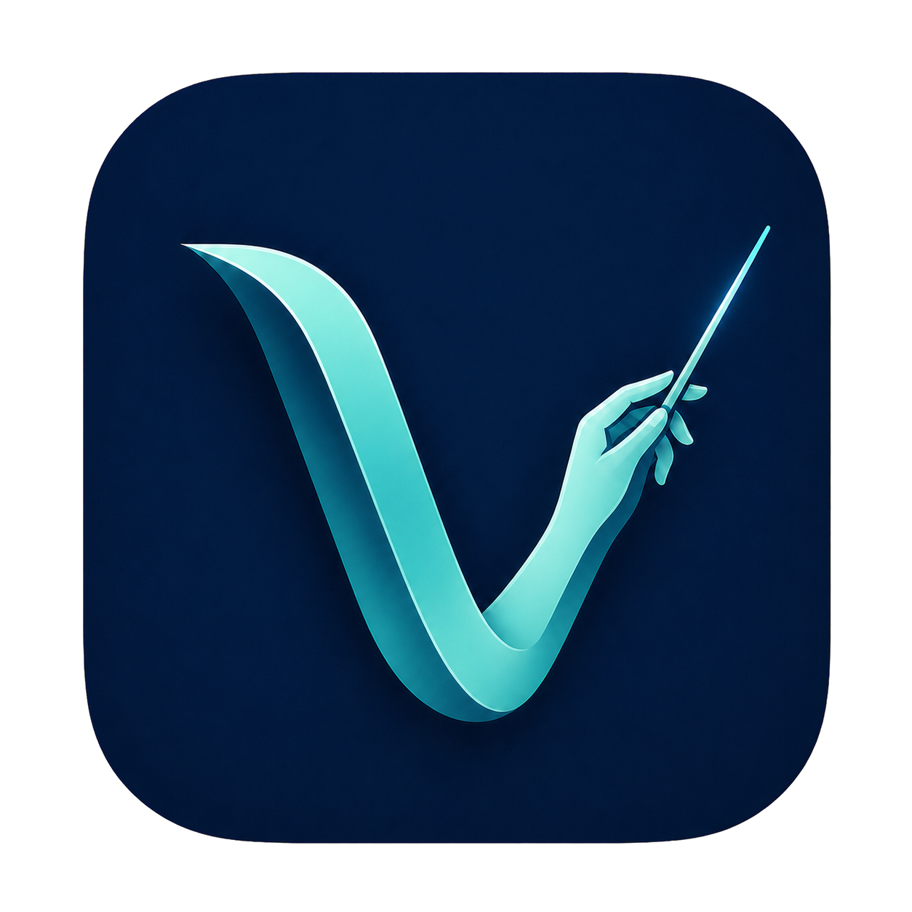
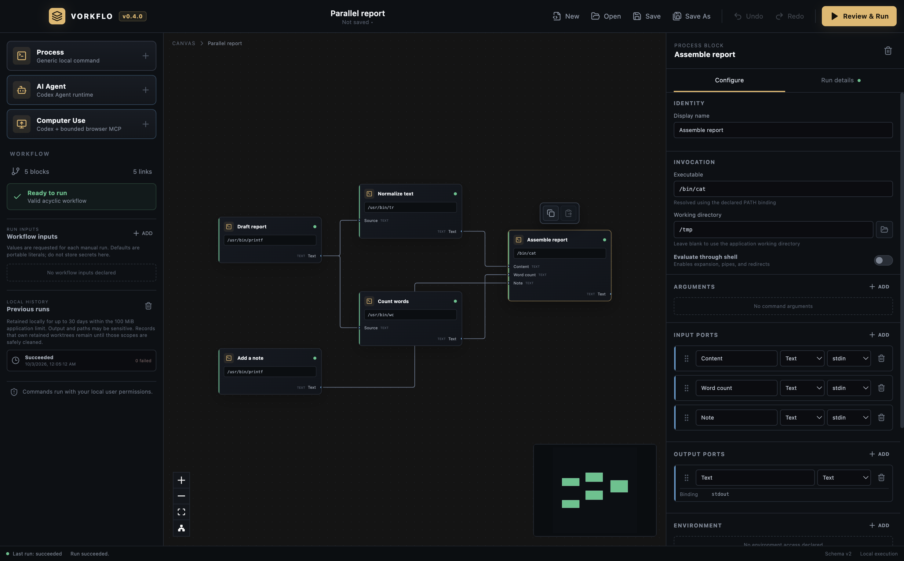

<div align="center">
  
  <h1>Vorkflo</h1>
  <p><strong>Your local tools. One visual workflow.</strong></p>
  <p>Build, run, and inspect automation on your own machine.</p>
  <p>
    
    
    
  </p>
</div>

Vorkflo turns trusted command-line tools into reusable visual workflows. Connect
processes on a canvas, pass text or files between them, review what will run,
and watch each step complete. Your workflows, tools, and execution history stay
local.



A completed synthetic workflow: parallel branches on the canvas, visible block
states, and the selected process's configuration in the inspector.

## What you can do

- **Compose any local CLI.** Use Python, Git, FFmpeg, custom executables, or
  your existing tools with explicit arguments and environment bindings.
- **Connect agents.** Configure Codex, Cline, or Antigravity through the same
  process contract, with visible instructions and optional Git worktrees.
- **Follow the data.** Route text, JSON, and file references through a validated
  DAG. Independent branches can run in parallel.
- **Inspect every run.** Review inputs, outputs, errors, timing, and
  cancellation. Bounded local history survives application restarts.
- **Make room for your workflow.** Collapse the block library or inspector, zoom
  and pan the canvas, or arrange blocks by their dependencies.
- **Configure Computer Use.** Declare an MCP backend, HTTPS origins, allowed
  tools, a call budget, and a timeout for a generic browser task.

No Vorkflo account or cloud service is required. Tools you invoke may have their
own installation, authentication, or network requirements.

## Download

Open this repository's **Releases** tab and download the latest
`Vorkflo-…-mac-arm64.dmg` or ZIP, plus `SHA256SUMS.txt`.

The desktop release supports **Apple silicon Macs running macOS 12 or later**.
It is unsigned and unnotarized, so macOS may require an explicit security
override. See the [installation guide](docs/release/MACOS.md) for checksums,
installation, and removal.

## Start from source

Use Node.js 22.12 or later and npm 11 or later.

```sh
npm ci
npm run verify
npm run dev
```

The starter canvas contains a small, synthetic example. Add a process, configure
its command, connect compatible ports, then choose **Review & Run**. Review an
imported workflow as carefully as you would review a script.

## Around the editor

- **Block library:** add a Process, AI Agent, or Computer Use block. Configure
  workflow inputs and revisit previous runs from the same sidebar.
- **Canvas:** connect compatible ports, drag blocks to organize the workflow,
  and use the bottom-left controls to zoom, fit, or auto-arrange. The panel
  buttons in the canvas header give you more room without losing your edits.
- **Inspector:** select a block to edit its configuration or switch to **Run
  details** to inspect its inputs, output, errors, and timing.
- **Review & Run:** inspect the effective commands, working directories,
  environment bindings, and preflight results before confirming execution. The
  review scrolls while its confirmation and run controls stay visible.

## Examples

| Example                                                                   | Demonstrates                                                          |
| ------------------------------------------------------------------------- | --------------------------------------------------------------------- |
| [Parallel report](examples/workflows/parallel-report.vorkflo.json)        | Parallel branches, text transformations, and a joined report          |
| [Hello report](examples/workflows/hello-report.vorkflo.json)              | A small process DAG and portable workflow format                      |
| [Text to file](examples/workflows/text-to-file.vorkflo.json)              | Manual inputs, shell-free file output, and downstream file references |
| [File agent](examples/workflows/codex-file-agent.vorkflo.json)            | An opt-in agent that creates a declared report                        |
| [Shared worktree](examples/workflows/multi-runtime-worktree.vorkflo.json) | Ordered agents in an explicitly isolated Git worktree                 |

Agent examples use the installed tools and their account usage. Review their
configuration and run them in a disposable workspace. Keep your own input files
and workflows outside the repository.

## Development

The product website at [vorkflo.vrnrn.com](https://vorkflo.vrnrn.com/) lives in
[`site/`](site/README.md). Run `npm run site:dev` to preview it, or
`npm run site:verify` to build and check its standalone Cloudflare Pages output.

| Command                                | Purpose                                                               |
| -------------------------------------- | --------------------------------------------------------------------- |
| `npm run verify`                       | Public-source audit, formatting, build, types, and tests              |
| `npm run build`                        | Compile the engine, adapters, helpers, and desktop                    |
| `npm run desktop:smoke`                | Exercise real execution, cancellation, failures, and history recovery |
| `npm run desktop:smoke:packaged`       | Repeat the smoke with an installed application bundle                 |
| `npm run desktop:performance:packaged` | Measure the 51-node canvas and sustained dragging                     |
| `npm run release:mac`                  | Build and verify Apple silicon DMG/ZIP files and checksums            |
| `npm run workflow:check -- <file>`     | Validate a workflow without running it                                |
| `npm run workflow:run -- <file>`       | Execute a reviewed workflow headlessly                                |

```text
apps/desktop/                    Electron host, preload bridge, React canvas
packages/engine/                 Portable contracts, DAG validation, scheduler
packages/node-runner/            Local process and filesystem adapter
packages/mcp-policy-proxy/       Deterministic MCP policy enforcement
packages/markdown-context-runner/ Markdown context and evidence helpers
examples/                       Curated synthetic workflows
```

The engine has no desktop, UI, or provider dependencies. The renderer has no
direct Node.js, filesystem, or process access. See
[architecture](docs/architecture/FOUNDATION.md), [product vision](VISION.md),
and [contribution guidelines](CONTRIBUTING.md).

## Trust and privacy

Workflows are executable code. Processes run with your operating-system
permissions. Shell interpretation is opt-in; this application does not sandbox
arbitrary processes. Computer Use restricts MCP calls and URL arguments, but its
proxy does not isolate all browser network traffic.

Workflow files store environment references, not resolved host secret values.
Literal arguments, input defaults, and process output can still contain private
information. Inspect them before sharing. See [SECURITY.md](SECURITY.md) for the
full security model and private vulnerability reporting.

Released under the [MIT license](LICENSE).
